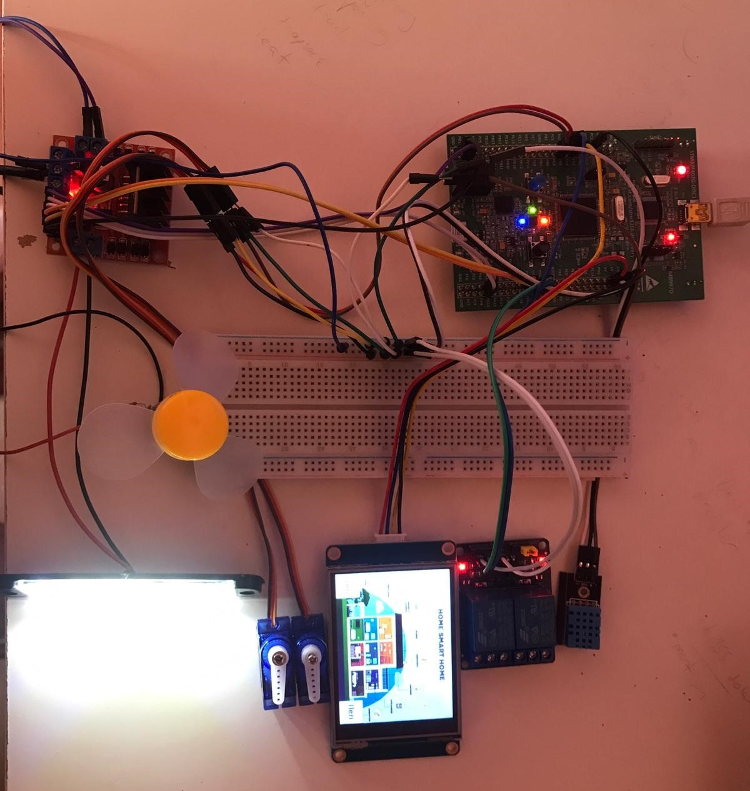

# STM32-NEXTION-AKILLI-EV
STM32F4 discovery ve 2.8 inch nextion dokunmatik ekran ile akıllı ev konsepti gercekleştirilmiştir.

Stm32F4	           Donanım        
- PB4	  Röle IN1	  GPIO_OUTPUT  
- PB5  	Röle IN2	  GPIO_OUTPUT   
- PD5 	L298N IN3	  GPIO_OUTPUT  
- PD6 	L298N EN4	  GPIO_OUTPUT  
- PA10	L298N IN2	  GPIO_OUTPUT  
- PA13	L298N IN3	  GPIO_OUTPUT  
- PC1 	DHT11 OUT	  GPIO_OUTPUT  
- PA3 	NEXTİON TX	USART2_RX  
- PA2	  NEXTİON RX	USART2_TX  
- PA7	  SERVO1 PWM	TIM3_CH2  
- PA6	  SERVO2 PWM	TIM3_CH1  
- PD15	L298N ENB	  TIM4_CH4   
- PD14	L298N ENA	  TIM4_CH3  

